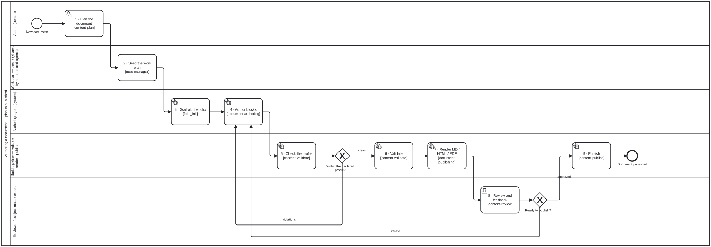
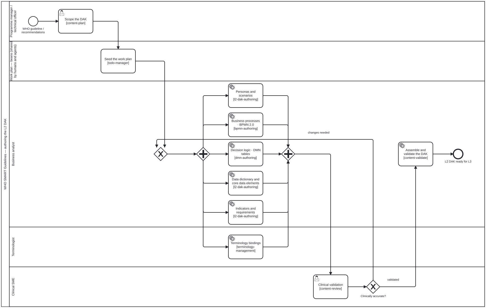
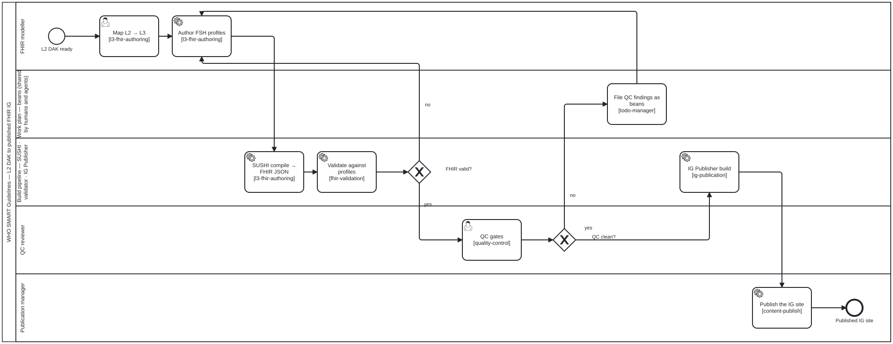

# Content types
{: .no_toc }

folio-assistant is **content-agnostic**: the platform knows nothing about any
particular paper or guideline. Each *kind* of content is supported by a
**content adapter** (code that knows how to validate/build/render that kind) and
a **skill package** (the authoring formalism — what an author and the LLM do).

> This page describes the **formalism** of each content type. It is intentionally
> kept separate from any concrete content; concrete artifacts live in their own
> content repository.

1. TOC
{:toc}

---

## The content lifecycle

Every content type moves through the same lifecycle, provided by the
cross-cutting **`content-lifecycle`** skill package:

  

[BPMN 2.0 source](workflows/content-lifecycle.bpmn) · [full-size SVG](assets/img/workflows/content-lifecycle.svg)
{: .bpmn-source }

| Stage | Skill | What happens |
|-------|-------|--------------|
| plan | `content-plan` | Scope the work, identify artifacts and actors |
| author | `content-author` | Create structured artifacts from source material |
| validate | `content-validate` | Check against schema + constraints |
| review | `content-review` | Human / SME review against criteria |
| test | `content-test` | Automated QA, build green, proofs/validators pass |
| publish | `content-publish` | Render and deploy the published form |
| feedback | `content-feedback` | Capture and route reviewer feedback |
| retire | `content-retire` | Deprecate or archive an artifact |

The lifecycle stages are the same regardless of content type — what differs is
the *authoring* skills and the *artifacts* each type produces. For the full list
of skills and the roles that drive them, see **[Skills & roles](skills.html)**.

Two things the eight stage names hide, and the diagram does not: `author` and
`validate` are not consecutive phases but a *loop* — every proposed change runs
the HCI validation gate, and the editor sees the findings before anything is
committed — and `review` happens twice, once per change and once over the
assembled draft. Both expand into their own diagrams on the
**[publication workflow](publication-workflow.html)** page.

---

## Documents & policy guidance

**Skill package:** `authoring-document` ·
**Adapter:** `document` ·
**Guide:** [Writing a document](guides/writing-a-document.html)

Structured prose: health-policy guidance (an L1 guideline, say), a standard, a
report, a handbook, a book chapter. Everything a paper is, minus the formal
layer — and therefore minus the two toolchains that serve it.

- **Source model** — the same tree of typed *blocks* as a paper, restricted to
  the kinds whose content is prose rather than a formal claim: `prose`,
  `example`, `remark`, `algorithm`, `simulator`, `equation`, `diagram`,
  `table`.
- **Rendering** — `document_render_md` assembles the folio into one Markdown
  file; `document_render_html` and `document_render_pdf` take it through
  pandoc. The PDF path uses an HTML engine (weasyprint, prince, wkhtmltopdf)
  and **never** falls back to `latexmk`, so "no TeX required" stays true rather
  than becoming true-until-someone-has-TeX-installed.
- **Enforcement** — `content_profile_check` rejects a math kind, a `lean`
  field or a `.lean` sibling, and runs on every `content_validate`.

Relevant skill schemas:
[`document-authoring`](reference/skills/document-authoring.html),
[`document-structure`](reference/skills/document-structure.html),
[`normative-statements`](reference/skills/normative-statements.html),
[`document-publishing`](reference/skills/document-publishing.html).

  

[BPMN 2.0 source](workflows/authoring-a-document.bpmn) · [full-size SVG](assets/img/workflows/authoring-a-document.svg)
{: .bpmn-source }

### Carrying a normative statement

A recommendation, requirement or rule is the block readers cite and
implementers trace to. It wants a label, a stable identity and a place in the
dependency graph — everything a `theorem` has — and it is emphatically not a
theorem, because nothing proves it.

There is **no first-class `recommendation` block kind**. Today the carrier is a
`prose` block with a label and a title; the
[`normative-statements`](reference/skill-instructions/normative-statements.html)
skill states the convention and its limits. Earlier guidance in
`document-intake` mapped guideline recommendations onto `definition` — that
predates this content type and is wrong for a document folio, where
`definition` is a math kind whose `lean` field is required.

---

## Scientific papers & books

**Skill package:** `authoring-math` ·
**Adapter:** `paper` ·
**Guide:** [Writing a paper](guides/writing-a-paper.html)

Rigorous scientific papers and books where prose and mathematics are backed by a
machine-checked **Lean 4** formalization and rendered through **LaTeX**.

> **A paper is a document plus Lean-bearing blocks.** Everything in the section
> above applies here: the same block tree, the same editorial `uses[]` graph,
> the same QA sidecars, the same lifecycle — and the Markdown render path, which
> works while drafting on a machine with no TeX. The `paper` adapter *extends*
> the `document` adapter in code, for exactly that reason. What a paper adds is
> the seven kinds below whose assertion is a formal claim, and the two
> toolchains that check and typeset them.

- **Source model** — content is a tree of typed *blocks* (`definition`,
  `theorem`, `lemma`, `proof`, `equation`, `prose`, …). See the
  [TypeScript API reference](api/) for `Block`, `Chapter`, and `Paper`.
- **Formalization** — `lean-formalization` and `proof-verification` skills drive
  Lean; each theorem-like block can be tracked against its Lean counterpart, and
  every `sorry` is auditable.
- **Rendering** — `latex-authoring` plus the paper adapter's
  `paper_render_pdf` / `paper_render_html` tools.

The seven kinds a document folio does **not** get, and the eight it shares:

| Block kind | Label prefix | Lean? | Profile |
|------------|-------------|-------|---------|
| `definition` | `def:` | **required** | paper only |
| `theorem` / `lemma` / `proposition` / `corollary` | `thm:` / `lem:` / … | expected | paper only |
| `conjecture` | `conj:` | optional | paper only |
| `proof` | `prf:` | optional | paper only |
| `example` / `remark` | `ex:` / `rem:` | optional | shared |
| `algorithm` / `simulator` | `alg:` / `sim:` | optional | shared |
| `prose` / `equation` / `diagram` / `table` | `prose:` / `eq:` / `fig:` / `tbl:` | n/a | shared |

The four `paper only` rows are `MATH_BLOCK_KINDS` in
[`schemas/block-kinds.ts`](https://github.com/litlfred/folio-assistant/blob/main/schemas/block-kinds.ts);
the `shared` rows are `DOCUMENT_BLOCK_KINDS`, derived as the complement so a
kind added later cannot go unclassified.

Two of those rows are worth a second look. `definition` is the sharpest point
of the whole split — it is the one kind whose `lean` field is *required* rather
than optional, so a document folio could not hold one even if the profile
allowed it. And the `shared` kinds still *declare* an optional `lean`: the type
permits what the profile forbids, which is why `content_profile_check` has a
second rule beyond "is this kind allowed".

Relevant skill schemas:
[`latex-authoring`](reference/skills/latex-authoring.html),
[`lean-formalization`](reference/skills/lean-formalization.html),
[`proof-verification`](reference/skills/proof-verification.html).

---

## WHO SMART Guidelines DAKs (L2)

**Skill package:** `authoring-who-smart-guidelines` ·
**Guide:** [Authoring a WHO SMART DAK](guides/who-smart-dak.html)

A **Digital Adaptation Kit (DAK)** is the *L2* (machine-readable, but
implementation-neutral) representation of a WHO guideline. folio-assistant
authors the L2 artifacts:

- **Business processes** — BPMN 2.0 workflows (`bpmn-authoring`)
- **Decision logic** — DMN decision tables (`dmn-authoring`)
- **Data dictionaries / core data elements** — Excel / structured tables
- **Terminology** — code systems and value sets (`terminology-management`)
- **Personas, scenarios, indicators, requirements**

Relevant skill schemas:
[`l2-dak-authoring`](reference/skills/l2-dak-authoring.html),
[`bpmn-authoring`](reference/skills/bpmn-authoring.html),
[`dmn-authoring`](reference/skills/dmn-authoring.html),
[`terminology-management`](reference/skills/terminology-management.html).

  

[BPMN 2.0 source](workflows/l2-dak-authoring.bpmn) · [full-size SVG](assets/img/workflows/l2-dak-authoring.svg)
{: .bpmn-source }

---

## WHO SMART Implementation Guides (L3)

**Skill package:** `authoring-who-smart-guidelines` ·
**Guide:** [Authoring a WHO SMART IG](guides/who-smart-ig.html)

The *L3* layer turns an L2 DAK into a computable **FHIR Implementation Guide**:

- **FHIR resources** authored as **FSH** (FHIR Shorthand) and compiled with
  **SUSHI** (`l3-fhir-authoring`)
- **Validation** against FHIR profiles (`fhir-validation`)
- **Publication** with the **HL7 FHIR IG Publisher** (`ig-publication`)
- **Quality control** gates (`quality-control`)

Relevant skill schemas:
[`l3-fhir-authoring`](reference/skills/l3-fhir-authoring.html),
[`fhir-validation`](reference/skills/fhir-validation.html),
[`ig-publication`](reference/skills/ig-publication.html),
[`quality-control`](reference/skills/quality-control.html).

  

[BPMN 2.0 source](workflows/l3-fhir-pipeline.bpmn) · [full-size SVG](assets/img/workflows/l3-fhir-pipeline.svg)
{: .bpmn-source }

---

## Others — extending folio-assistant

New content types are first-class: add a content **adapter** and a skill
**package**, and the lifecycle, RBAC, and MCP plumbing come for free. See
[Adding a content type](guides/new-content-type.html).
