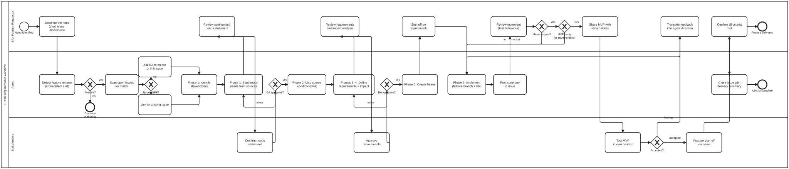

# CRDM methodology
{: .no_toc }

  
On this page

  {: .text-delta }
1. TOC
{:toc}

_This page is generated from [`content/docs/crdm-methodology/`](https://github.com/litlfred/folio-assistant/tree/main/content/docs/crdm-methodology) — each section below links to its own source._

[✎ Edit](https://github.com/litlfred/folio-assistant/edit/main/content/docs/crdm-methodology/overview.md){: .fa-node-edit title="Edit content/docs/crdm-methodology/overview.md" }

How folio-assistant uses the **Collaborative Requirements Development
Methodology** (CRDM) — a structured, participatory framework from the
[Public Health Informatics Institute](https://phii.org/) — to manage feature
requests, platform changes, and content-pipeline evolution. When a user,
reviewer, or editor asks for something that is not content but
**capability** — a new block kind, a rendering change, a QA criterion — the
agent enters a CRDM-guided workflow rather than improvising a solution.

---

## What is CRDM?
{: #what-is-crdm }

[✎ Edit](https://github.com/litlfred/folio-assistant/edit/main/content/docs/crdm-methodology/what-is-crdm.md){: .fa-node-edit title="Edit content/docs/crdm-methodology/what-is-crdm.md" }

The **Collaborative Requirements Development Methodology** (CRDM)™ is a
structured, facilitated approach developed by the
[Public Health Informatics Institute (PHII)](https://phii.org/) to help
organisations document workflows and define functional requirements for
information systems. Rather than starting with technology, the methodology
prioritises understanding the underlying business processes first.

CRDM organises work into three primary areas of concentration:

1. **Business Process Analysis (BPA)** — document and analyse how the
   organisation currently performs its work. Understand manual workflows,
   identify bottlenecks, clarify how data is collected and used.

2. **Business Process Redesign (BPR)** — once the current state is understood,
   identify areas for improvement. Streamline operations and design a more
   efficient future-state workflow that the new capability will support.

3. **Requirements Definition** — define specific functional requirements for the
   information system based on the redesigned business processes. Ensure the
   result is fit-for-purpose, scalable, and interoperable.

The key insight is **"begin with the end in mind"**: technical requirements must
be intentionally aligned with achieving specific outcomes rather than reacting to
a feature request at the surface level.

> **References:**
> - [PHII — CRDM](https://phii.org/crdm/) — the canonical description
> - [PATH — Collaborative Requirements Development Methodology](https://www.path.org/our-impact/resources/collaborative-requirements-development-methodology-participatory-process-end-users-define-software-requirements-improves-system-design-implementation/) — the PATH adaptation for global health informatics
> - Issue [#203](https://github.com/litlfred/folio-assistant/issues/203) — the request that initiated this integration

## Why CRDM for folio-assistant
{: #why-crdm-for-folio-assistant }

[✎ Edit](https://github.com/litlfred/folio-assistant/edit/main/content/docs/crdm-methodology/why-crdm-for-folio-assistant.md){: .fa-node-edit title="Edit content/docs/crdm-methodology/why-crdm-for-folio-assistant.md" }

folio-assistant is a **platform**, not an application with a fixed feature set.
Authors, editors, and reviewers working in folio repositories regularly discover
needs that are not content — they are **capability gaps** in the platform itself:
a missing block kind, a QA criterion that does not exist, a rendering mode that
does not handle their document structure, a workflow step that has no tooling.

Without a methodology, agents improvise. The history of this repository shows
what that looks like: a feature request arrives as a chat message, the agent
builds something that addresses the immediate symptom, and the result does not
compose with the rest of the platform — because nobody mapped the current
workflow, identified who else is affected, or wrote the requirements down before
coding started.

CRDM solves this by inserting a **structured requirements phase** between "I need
this" and "here is the code". The methodology is a natural fit because
folio-assistant already has the primitives it needs:

| CRDM concept | folio-assistant primitive |
|---|---|
| Stakeholder identification | `folio.config.json` roles, GitHub CODEOWNERS |
| Business process documentation | BPMN workflow diagrams under `docs/workflows/` |
| Requirements artefact | GitHub issue with structured fields |
| Work-plan items | `beans` — the single todo mechanism |
| Impact analysis | Content graph (`content-graph.ts`), schema constraints, QA registry |
| Iterative review | PR-based feedback, `content_validate`, `qa_sweep` |

The goal is not to add ceremony. It is to make the agent **recognise** when a
request is a feature rather than content, and shift into a requirements-gathering
mode rather than jumping straight to implementation.

## When the CRDM workflow activates
{: #when-crdm-activates }

[✎ Edit](https://github.com/litlfred/folio-assistant/edit/main/content/docs/crdm-methodology/when-crdm-activates.md){: .fa-node-edit title="Edit content/docs/crdm-methodology/when-crdm-activates.md" }

An agent enters the CRDM workflow when it recognises that a request is about
**platform capability** rather than **folio content**. The triggers are:

1. **Explicit feature request** — the user says "I need a new block kind", "add
   a QA check for X", "the renderer should support Y". These are unambiguous.

2. **GitHub issue tagged as a feature or enhancement** — when the agent is asked
   to resolve an issue whose labels or body describe new functionality rather
   than a content edit.

3. **Discussion-derived need** — during an authoring session, the user
   encounters a limitation. The conversation shifts from "write this chapter" to
   "the platform should be able to do X". The agent detects this shift.

4. **Schema or pipeline change** — a request that would modify files under
   `schemas/`, `content/pipeline/`, `adapters/`, or `src/` rather than under a
   folio's `content/<paper>/`.

5. **Cross-cutting concern** — the request affects multiple folios or multiple
   content types. A single-folio content edit does not trigger CRDM; a change
   to how all folios validate does.

**The detection rule:** if implementing the request would require changes to
folio-assistant (the platform repository) rather than to a folio repository, the
request is a feature, and the agent should enter CRDM rather than coding
directly.

When the agent detects a CRDM trigger, it should:

1. **Acknowledge** — tell the user it has recognised a feature request
2. **Cite the source** — link to the issue, message, or conversation turn
3. **Propose entering the CRDM workflow** — explain what that means (structured
   requirements gathering before implementation)
4. **Get consent** — the user may prefer to skip the methodology for small
   changes; the agent respects that but notes the risk

## The process
{: #the-process }

[✎ Edit](https://github.com/litlfred/folio-assistant/edit/main/docs/workflows/crdm-requirements.bpmn){: .fa-node-edit title="Edit docs/workflows/crdm-requirements.bpmn" }

  

[Open the BPMN source](workflows/crdm-requirements.bpmn){: .btn .btn-outline }

The diagram above shows the full CRDM workflow as a BPMN 2.0 collaboration
with three swim lanes:

- **Requestor / stakeholder** — submits the request, reviews the synthesised
  needs and requirements, signs off, reviews PRs, and does final feature
  sign-off on the issue.

- **Agent** — detects the feature request, scans for matching issues, runs
  through the six CRDM phases, creates beans, implements on feature branches,
  posts summaries to the issue.

- **Platform** — automated CI gates (`content_validate`, `qa_sweep`,
  code-quality gates) that verify each PR.

Two feedback loops are visible:

1. **Needs loop** (Phases 1–2) — the agent synthesises needs and the
   requestor reviews; if revisions are needed, the agent re-synthesises.

2. **Requirements loop** (Phases 3–4) — the agent defines requirements and
   impact analysis; the requestor reviews; iterate until approved.

3. **Implementation loop** (Phase 6) — the agent implements, posts a summary
   to the issue, the requestor reviews the PR; iterate until all beans are
   resolved.

Each loop's review happens **on the GitHub issue**, making the process
transparent, persistent, and accessible to stakeholders who join later.

See the [agentic harness](../agentic-harness.html) page for how this
workflow fits into the broader agent–user interaction model.

## Phase 1 — Needs assessment
{: #phase-1-needs-assessment }

[✎ Edit](https://github.com/litlfred/folio-assistant/edit/main/content/docs/crdm-methodology/phase-1-needs-assessment.md){: .fa-node-edit title="Edit content/docs/crdm-methodology/phase-1-needs-assessment.md" }

The agent helps the user articulate **what they need and why**, before anyone
discusses how to build it. This is where most ad-hoc requests go wrong — the
solution is specified before the problem is understood.

**What the agent does in this phase:**

1. **Identify the requester and stakeholders** — who is asking, who else is
   affected? The word-document-import request ([#197](https://github.com/litlfred/folio-assistant/issues/197))
   came from one person but affects anyone doing public consultation review,
   HRH handbook adaptation, or PCMT traceability. The agent should surface
   those connections.

2. **Synthesise the need from multiple sources** — a requirement rarely arrives
   as a clean statement. It comes from a chat message, a GitHub issue, a
   discussion thread, a review comment. The agent gathers these fragments and
   presents a consolidated statement of need back to the user for validation.

3. **Suggest other stakeholders** — if the request touches a workflow that
   others use (e.g. country adaptation, formal review processes), the agent
   should identify who else should weigh in and propose inviting them.

4. **Document the "why"** — every requirement gets a rationale. Not "import
   Word documents" but "enable public consultation comment triage through a
   structured ingestion pipeline, so that SAG members can review and approve
   changes through a formal process."

**Deliverable:** a GitHub issue (or issue comment) with:
- Statement of need
- Identified stakeholders
- Rationale linking the need to a concrete workflow
- References to the conversation or discussion that surfaced the need

## Phase 2 — Business process analysis
{: #phase-2-business-process-analysis }

[✎ Edit](https://github.com/litlfred/folio-assistant/edit/main/content/docs/crdm-methodology/phase-2-business-process-analysis.md){: .fa-node-edit title="Edit content/docs/crdm-methodology/phase-2-business-process-analysis.md" }

Before changing the platform, understand **how the work is done today**. The
agent maps the current workflow — manually if needed — and identifies where the
gap actually sits.

**What the agent does in this phase:**

1. **Map the current workflow** — use the existing BPMN diagrams under
   `docs/workflows/` as a starting point. If the affected workflow is already
   diagrammed (e.g. the content lifecycle, the publication pipeline, the
   document ingestion flow), read it and identify the specific activity or
   decision point where the gap appears.

2. **Identify bottlenecks and pain points** — the request "import Word
   documents" might mask a deeper problem: "the public consultation feedback
   arrives as an Excel spreadsheet and a Word document, and there is no way to
   triage 200 comments without manually reading each one." The agent should
   probe for the real bottleneck.

3. **Check existing capabilities** — before proposing new tooling, verify what
   already exists. folio-assistant's ingestion pipeline already handles PDFs,
   images, and structured text. Does the request require a new capability or an
   extension of an existing one?

4. **Document the current state** — write up the as-is workflow, either as
   prose in the issue or as a BPMN fragment. This becomes the baseline against
   which the redesign is measured.

**Deliverable:** a current-state workflow description attached to the issue,
identifying exactly where the capability gap sits.

## Phase 3 — Requirements definition
{: #phase-3-requirements-definition }

[✎ Edit](https://github.com/litlfred/folio-assistant/edit/main/content/docs/crdm-methodology/phase-3-requirements-definition.md){: .fa-node-edit title="Edit content/docs/crdm-methodology/phase-3-requirements-definition.md" }

Translate the understood need into **specific, actionable requirements** with
proposed tooling descriptions. All requirements should be developed fully, with
proposed `.ts` skills, software tooling descriptions, and requirements for
folio-assistant SOPs.

**What the agent produces in this phase:**

1. **Functional requirements** — each stated as a testable capability:
   - "The ingestion engine SHALL detect `.docx` files in `uploads/` and extract
     semantic structure (headings, lists, tables) into Markdown."
   - "The review triage tool SHALL present comments grouped by document section
     and allow batch accept/reject/defer decisions."

2. **Proposed skills and tooling** — for each requirement, a concrete
   description of the skill or tool that implements it:
   - Skill name, description, and which adapter it belongs to
   - Input/output contract
   - MCP tool registration (if applicable)
   - QA criteria (if applicable)

3. **Schema changes** — if the requirement needs new types, block kinds,
   constraint rules, or configuration fields, these are specified here with
   their Zod schemas.

4. **Pipeline changes** — if the requirement needs new pipeline scripts under
   `content/pipeline/`, new validators, or new renderers, the file names and
   responsibilities are listed.

5. **Acceptance criteria** — how we know the requirement is met. Each criterion
   should be mechanically testable where possible.

**Deliverable:** a requirements document in the GitHub issue, structured as a
checklist of capabilities with their proposed implementations. Each requirement
links back to the need (Phase 1) and the workflow gap (Phase 2) it addresses.

## Phase 4 — Impact analysis and migration planning
{: #phase-4-impact-analysis }

[✎ Edit](https://github.com/litlfred/folio-assistant/edit/main/content/docs/crdm-methodology/phase-4-impact-analysis.md){: .fa-node-edit title="Edit content/docs/crdm-methodology/phase-4-impact-analysis.md" }

Before implementation begins, assess **what the proposed changes affect** across
the platform and any active folios.

**What the agent analyses:**

1. **Content impact** — does the change affect existing folio content? If a
   schema changes, which folios need migration? The content graph
   (`content-graph.ts`) and the constraint rules (`schemas/constraints.ts`)
   make this measurable.

2. **Pipeline impact** — which pipeline scripts are affected? Does the change
   require new validators, new renderers, or modifications to existing ones?
   List every file under `content/pipeline/` that would be touched.

3. **QA impact** — does the change add, modify, or remove QA criteria? How does
   it affect the existing QA sweep results? Any criterion change must be
   registered in `qa-criteria-registry.ts`.

4. **Adapter impact** — does the change affect one adapter (paper, document,
   dak) or all? Changes to `DocumentContentAdapter` ripple into
   `PaperContentAdapter` because it extends it.

5. **Migration plan** — if existing content or configuration must change, write
   the migration steps. Include:
   - Which folios are affected
   - What the codemod or manual migration looks like
   - What breaks if the migration is not run
   - Rollback strategy

6. **Test plan** — what tests need to be added or updated? Which existing tests
   might break?

**Deliverable:** an impact assessment section in the GitHub issue listing every
affected file, folio, and workflow, with a migration plan if applicable.

## Phase 5 — Sign-off and bean creation
{: #phase-5-sign-off-and-beans }

[✎ Edit](https://github.com/litlfred/folio-assistant/edit/main/content/docs/crdm-methodology/phase-5-sign-off-and-beans.md){: .fa-node-edit title="Edit content/docs/crdm-methodology/phase-5-sign-off-and-beans.md" }

The requirements and impact analysis are presented to the user (and any
identified stakeholders) for review and sign-off. This is the gate between
requirements and implementation.

**The sign-off process:**

1. **Present the consolidated requirements** — the agent produces a summary
   comment on the GitHub issue containing:
   - The need statement (Phase 1)
   - The current-state workflow and gap (Phase 2)
   - The requirements checklist (Phase 3)
   - The impact assessment and migration plan (Phase 4)

2. **Solicit feedback** — ask the user and stakeholders to review. The review
   happens **on the issue**, not in chat — so it is visible, linkable, and
   survives beyond any single session. This is the transparent review process:
   comments, questions, and revisions are all recorded in the issue thread.

3. **Iterate** — if the review surfaces new requirements, missing stakeholders,
   or concerns about the impact, cycle back to the relevant phase. The issue
   thread records each iteration.

4. **Create beans** — once the requirements are agreed, the agent creates
   `beans` for each unit of implementation work. Each bean:
   - References the parent issue
   - Has a clear title describing the deliverable
   - Is scoped to a single PR-sized unit of work
   - Is created using the [check-before-create
     protocol](https://litlfred.github.io/folio-assistant/guides/agent-onboarding.html)
     to avoid duplicates

5. **Record the decision** — the sign-off comment on the issue serves as the
   decision record. It states what was agreed, what was deferred, and links to
   the beans that will implement it.

**Deliverable:** a sign-off comment on the issue, plus beans for each work item.

## Phase 6 — Iterative development and review
{: #phase-6-iterative-development }

[✎ Edit](https://github.com/litlfred/folio-assistant/edit/main/content/docs/crdm-methodology/phase-6-iterative-development.md){: .fa-node-edit title="Edit content/docs/crdm-methodology/phase-6-iterative-development.md" }

Once the requirements are signed off and beans are created, the agent enters
the normal development cycle — but with the CRDM artefacts as guardrails.

**How the development cycle uses CRDM artefacts:**

1. **Bean-driven work** — each bean references the parent issue and its
   specific requirement. The agent claims a bean, implements it, opens a PR,
   and links both.

2. **PR review against requirements** — reviewers check not just "does the code
   work?" but "does it satisfy the requirement stated in the issue?" The
   acceptance criteria from Phase 3 are the review checklist.

3. **Testing against the workflow** — the redesigned workflow from Phase 2
   should be testable after implementation. Does the ingestion pipeline now
   handle Word documents? Can a reviewer triage 200 comments through the new
   tool?

4. **Feedback loops** — after initial testing, users provide feedback. If the
   feedback reveals new requirements or missed cases, a new iteration of the
   CRDM phases is triggered — but scoped: only the affected requirement is
   re-assessed, not the entire feature.

5. **Documentation update** — when the feature lands, the documentation pages
   (these structured `.ts`/`.md` pages under `content/docs/`) are updated to
   reflect the new capability. Workflow BPMN diagrams are updated if the
   pipeline changed.

6. **Close the loop** — when all beans for the feature are resolved, the agent
   closes the parent issue with a summary of what was delivered and any
   deferred items. Deferred items become new issues for future CRDM cycles.

This is the process that the discussion around issue
[#197](https://github.com/litlfred/folio-assistant/issues/197) proposed to
generalise: create MVP tooling → test → refine → deploy. CRDM gives that
process a name and a structure so it can be repeated for any feature request —
whether it is Word document import, Harvard document engine workflows, HRH
handbook adaptation, or country-level review SOPs.

## Agent skills and tooling
{: #agent-skills-and-tooling }

[✎ Edit](https://github.com/litlfred/folio-assistant/edit/main/content/docs/crdm-methodology/agent-skills-and-tooling.md){: .fa-node-edit title="Edit content/docs/crdm-methodology/agent-skills-and-tooling.md" }

The CRDM workflow is supported by skills and tools that the agent uses at each
phase. Some exist today; others are proposed.

### Existing capabilities

| Capability | Used in phase | How |
|---|---|---|
| **GitHub issue management** (`gh` CLI) | All phases | Issues are the primary artefact for requirements, impact analysis, and sign-off |
| **BPMN workflow authoring** (skill: `bpmn-authoring`) | Phase 2 | Agent can create and modify BPMN 2.0 process diagrams |
| **Content graph** (`content-graph.ts`) | Phase 4 | Dependency analysis across blocks and chapters |
| **QA criteria registry** (`qa-criteria-registry.ts`) | Phase 3, 4 | Register and scope new QA checks |
| **Beans** (`beans` CLI) | Phase 5, 6 | Work-plan creation and tracking |
| **Content validation** (`content_validate` MCP tool) | Phase 6 | Verify changes against schema and constraints |
| **Schema types** (`schemas/*.ts`) | Phase 3 | Define new types, constraints, and builders |
| **Document ingestion** (`uploads/` → `library/` pipeline) | Phase 2 | Ingest source documents for review |

### Proposed skills

| Skill | Phase | Purpose |
|---|---|---|
| **`crdm-detect`** | Trigger | Recognise when a request is a feature rather than content |
| **`crdm-needs-assessment`** | Phase 1 | Guide the user through needs articulation; identify stakeholders |
| **`crdm-impact-analysis`** | Phase 4 | Automated scan of affected schemas, pipeline scripts, adapters, and folios |
| **`crdm-requirements-template`** | Phase 3 | Generate structured requirements from conversation |
| **`review-triage`** | Phase 6 | Triage review comments from ingested documents (e.g. public consultation feedback) |

### Proposed tooling

| Tool | Purpose |
|---|---|
| **`crdm_start` MCP tool** | Enter CRDM mode for a given issue; scaffold the phases in the issue body |
| **`crdm_status` MCP tool** | Report which phase the current CRDM cycle is in and what deliverables are pending |
| **`stakeholder_map` MCP tool** | Given a proposed change, identify affected roles from `folio.config.json` and CODEOWNERS |

## What is not built yet
{: #what-is-not-built-yet }

[✎ Edit](https://github.com/litlfred/folio-assistant/edit/main/content/docs/crdm-methodology/what-is-not-built-yet.md){: .fa-node-edit title="Edit content/docs/crdm-methodology/what-is-not-built-yet.md" }

This page documents the methodology; the skills and tooling that implement it
are in various stages of development.

**Not yet implemented:**

- **CRDM detection skill** — the agent does not yet automatically recognise
  when a request is a feature vs content. Today this is a human judgement.
- **Structured requirements templates** — no MCP tool scaffolds the CRDM
  phases into a GitHub issue. The structure described above is manual.
- **Automated impact analysis** — the agent can read the content graph and
  schema files, but there is no dedicated tool that produces an impact report
  for a proposed change.
- **Stakeholder mapping** — no automated discovery of affected roles or
  folios from a proposed change description.
- **Review triage tooling** — the ability to ingest a Word document with
  comments and present them for structured triage is tracked in
  [#197](https://github.com/litlfred/folio-assistant/issues/197).
- **BPMN diagram for the CRDM workflow itself** — this page describes the
  process in prose; a BPMN diagram would make it executable and verifiable.

**Tracked in:** [#203](https://github.com/litlfred/folio-assistant/issues/203)
