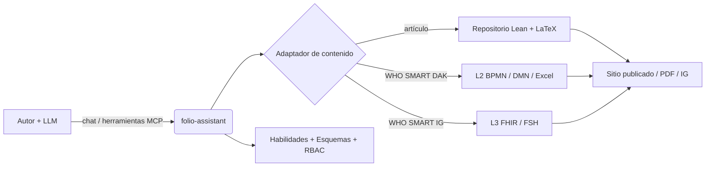
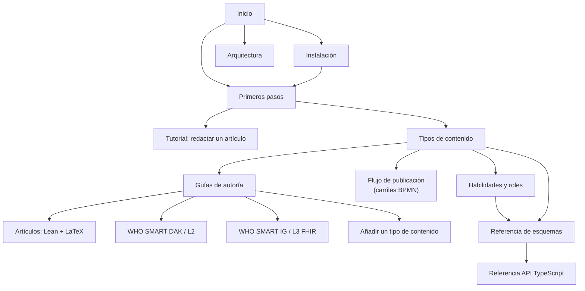

# folio-assistant
{: .fs-9 }

Un marco de habilidades de agente independiente del contenido para la autoría de
contenido riguroso con un modelo de lenguaje grande — artículos científicos y
libros, Directrices SMART de la OMS y Guías de Implementación FHIR —
respaldado por un servidor MCP, control de acceso basado en roles y un modelo
de objetos de contenido tipado.
{: .fs-6 .fw-300 }

[Comenzar](../getting-started.html){: .btn .btn-primary .fs-5 .mb-4 .mb-md-0 .mr-2 }
[Instalar](../installation.html){: .btn .fs-5 .mb-4 .mb-md-0 .mr-2 }
[Ver en GitHub](https://github.com/litlfred/folio-assistant){: .btn .fs-5 .mb-4 .mb-md-0 }

---

## ¿Qué es folio-assistant?

**folio-assistant** es la *plataforma* — no contiene contenido. Proporciona
las habilidades, los esquemas, las herramientas y un servidor MCP (Model Context
Protocol) que un agente impulsado por LLM utiliza para planificar, redactar, validar,
revisar, probar y publicar un **folio** de contenido que reside en un repositorio independiente.

> **Separación de responsabilidades.** Esta documentación describe el *formalismo del
> marco de trabajo* y *cómo usar folio-assistant* — mantenido deliberadamente **separado
> de cualquier contenido específico**. Cuando aparece contenido en estas páginas, es
> puramente ilustrativo (un *ejemplo*), nunca el artefacto canónico.

## Tipos de contenido admitidos

folio-assistant es **extensible** — cada tipo de contenido es gestionado por un
adaptador de contenido y un paquete de habilidades correspondiente. Los tipos
admitidos actualmente:

| Tipo de contenido | Artefactos | Paquete de habilidades |
|-------------------|------------|------------------------|
| **Artículos científicos y libros** | Formalización Lean 4 + LaTeX/Markdown | [`authoring-math`](../content-types.html#scientific-papers--books) |
| **Kits de adaptación digital (DAK) de las Directrices SMART de la OMS** | Artefactos L2 — BPMN, DMN, diccionarios de datos Excel, personas | [`authoring-who-smart-guidelines`](../content-types.html#who-smart-guidelines-daks-l2) |
| **Guías de implementación SMART de la OMS** | Recursos FHIR L3, FSH, salida de IG Publisher | [`authoring-who-smart-guidelines`](../content-types.html#who-smart-implementation-guides-l3) |
| **Otros** | Extensible — agregue un nuevo adaptador + paquete de habilidades | [Añadir un tipo de contenido](../guides/new-content-type.html) |

El ciclo transversal [`content-lifecycle`](../content-types.html#the-content-lifecycle)
(planificar → redactar → validar → revisar → probar → publicar → retroalimentación → retirar)
se aplica a cada tipo de contenido. El
[flujo de publicación](../publication-workflow.html) lo modela adecuadamente —
en diagramas de carriles BPMN, con los roles, la puerta de validación HCI y el
plan de trabajo compartido.

## A dónde ir a continuación

- **[Instalación](../installation.html)** — requisitos previos, clonación, `bun install`, verificación de capacidades.
- **[Primeros pasos](../getting-started.html)** — conecte el servidor MCP a su LLM y ejecute su primera habilidad.
- **[Tutorial: Redactar un artículo con folio-assistant](../guides/writing-a-paper.html)** — un recorrido completo guiado por LLM con una sesión de chat simulada.
- **[Tipos de contenido](../content-types.html)** — el formalismo de cada dominio de autoría.
- **[Flujo de publicación](../publication-workflow.html)** — diagramas de carriles BPMN de los procesos de edición y publicación.
- **[Incorporación del agente](../guides/agent-onboarding.html)** — orientación para un agente LLM situado en un folio: primeros pasos, búsqueda de habilidades, el modelo de objetos de contenido, sidecars de QA.
- **[Habilidades y roles](../skills.html)** — cada habilidad y rol, y cómo interactúan junto con el LLM.
- **[Referencia del esquema de habilidades](../reference/skills/)** — contratos de entrada/salida generados para cada habilidad.
- **[Referencia de la API de TypeScript](../api/)** — el modelo de objetos de contenido (`Block`, `Chapter`, `Paper`, builders, restricciones Zod).
- **[Arquitectura](../architecture.html)** — adaptadores, servidor MCP, RBAC, el modelo de bloques.

## Mapa de la documentación

> Los nodos del mapa son clicables en el sitio de documentación.
