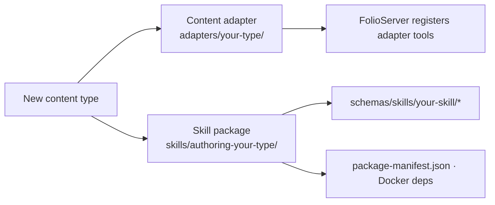

# Adding a new content type
{: .no_toc }

folio-assistant is content-agnostic by design. A new content type ("others" in
the supported-types list) is added by providing two things — a **content
adapter** and a **skill package** — after which the lifecycle, RBAC, MCP
transport, and work-plan plumbing all apply for free.

1. TOC
{:toc}

---

## What you provide



## 1. The content adapter

Model the `paper` adapter (`adapters/paper/`). An adapter:

- implements the content-adapter interface the `FolioServer` expects (list /
  validate / build, plus any type-specific tools);
- registers its MCP tools via `server.tool(...)` (e.g. the paper adapter adds
  `paper_render_pdf`, `lean_build`, …);
- resolves paths in the *content* repo, not in folio-assistant.

Wire it up by selecting it through the folio config:

```json
{
  "contentType": "your-type",
  "adapter": "your-type",
  "adapterModule": "./adapters/your-type/index.ts"
}
```

## 2. The skill package

Create `skills/authoring-your-type/package-manifest.json` declaring the skills
and the Docker/runtime dependencies (apt/pip/npm, setup commands, env). Follow
the existing manifests (`authoring-math`, `authoring-who-smart-guidelines`):

```json
{
  "name": "authoring-your-type",
  "version": "0.1.0",
  "description": "…",
  "skills": ["your-authoring", "your-validation"],
  "docker": { "baseImage": "ubuntu:24.04", "aptPackages": ["…"] },
  "providesCapabilities": ["…"],
  "lifecycleStages": ["plan", "author", "validate", "review", "test", "publish"]
}
```

## 3. The skill schemas

For each skill, add `schemas/skills/<skill>/input.schema.json` and
`output.schema.json` (JSON Schema draft-07). These are the typed contract the
LLM works against. Then regenerate the reference:

```sh
bun run scripts/gen-schema-docs.ts
```

Your skill pages appear automatically in the
[Skill schema reference](../reference/skills/).

## 4. Reuse the lifecycle

You do **not** re-implement plan/author/validate/review/test/publish — the
cross-cutting `content-lifecycle` package already provides those stages. Your
package only adds the *authoring* skills unique to the type.

## Checklist

- [ ] Adapter under `adapters/<type>/` implementing list/validate/build + tools
- [ ] `folio.config.json` points at the adapter
- [ ] Skill package + `package-manifest.json` with Docker deps
- [ ] JSON Schemas under `schemas/skills/<skill>/`
- [ ] `bun run scripts/gen-schema-docs.ts` regenerated
- [ ] Capabilities probed by `check_dependencies`
- [ ] Tests (`bun test`) and lint (`eslint .`) green
