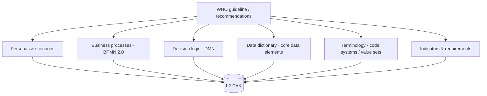

# Authoring a WHO SMART DAK (L2)
{: .no_toc }

A **Digital Adaptation Kit (DAK)** is the *L2* — machine-readable but
implementation-neutral — representation of a WHO SMART Guideline. This guide
covers authoring the L2 artifacts with folio-assistant and an LLM.

**Skill package:** `authoring-who-smart-guidelines`

1. TOC
{:toc}

---

## The L2 artifacts

| Artifact | Skill | Format |
|----------|-------|--------|
| Business processes | [`bpmn-authoring`](../reference/skills/bpmn-authoring.html) | BPMN 2.0 XML |
| Decision logic | [`dmn-authoring`](../reference/skills/dmn-authoring.html) | DMN tables |
| Data dictionary | [`l2-dak-authoring`](../reference/skills/l2-dak-authoring.html) | Excel / structured |
| Terminology | [`terminology-management`](../reference/skills/terminology-management.html) | code systems / value sets |
| Review | [`content-review`](../reference/skills/content-review.html) | criteria-based |

## Workflow

1. **Plan** — `content-plan`: enumerate the processes, decisions, and data
   elements the guideline implies; identify actors (business analyst, clinical
   SME, terminologist).
2. **Author business processes** — ask the agent to draft BPMN for each clinical
   workflow (`bpmn-authoring`); it produces valid BPMN 2.0.
3. **Author decision logic** — capture recommendations as DMN decision tables
   (`dmn-authoring`), linked to the data dictionary.
4. **Author the data dictionary** — define core data elements with types,
   cardinality, and terminology bindings (`l2-dak-authoring`).
5. **Manage terminology** — define code systems / value sets and bind them
   (`terminology-management`).
6. **Validate & review** — `content-validate` then `content-review` against the
   DAK criteria.

## A mock session

> **You:** Plan the L2 DAK for the immunization guideline — I need the
> "administer vaccine" process and the "is the client due" decision.
>
> **Assistant:** *(loads `content-plan`)* Proposed: 1 BPMN process
> `administer-vaccine`, 1 DMN decision `client-due-for-vaccine`, 4 core data
> elements (client id, antigen, dose number, date administered), 1 value set
> (antigen codes). Scaffold it?
>
> **You:** Yes.
>
> **Assistant:** *(loads `bpmn-authoring`, `dmn-authoring`, `l2-dak-authoring`)*
> Created the BPMN with start → check eligibility → administer → record, the DMN
> table keyed on age/last-dose, and the data dictionary. *(calls
> `content_validate`)* All artifacts valid.

## Next

Turn the L2 DAK into a computable FHIR Implementation Guide →
[Authoring a WHO SMART IG (L3)](who-smart-ig.html).
