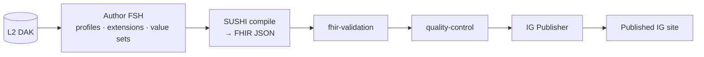

# Authoring a WHO SMART IG (L3)
{: .no_toc }

The *L3* layer turns an L2 DAK into a computable **FHIR Implementation Guide**.
This guide covers authoring FHIR artifacts as FSH, compiling with SUSHI,
validating, and publishing with the HL7 IG Publisher — all driven by the LLM.

**Skill package:** `authoring-who-smart-guidelines`

1. TOC
{:toc}

---

## Prerequisites

The L3 toolchain is heavier than the platform baseline. The
`authoring-who-smart-guidelines` package's Docker manifest provisions it; to run
locally you need:

| Tool | Purpose | Install |
|------|---------|---------|
| Java 21 (JRE) | IG Publisher | `apt install openjdk-21-jre-headless` |
| FHIR IG Publisher | build the IG | download `publisher.jar` from [HL7/fhir-ig-publisher](https://github.com/HL7/fhir-ig-publisher/releases/latest) |
| SUSHI (`fsh-sushi`) | compile FSH → FHIR | `npm i -g fsh-sushi` |
| Jekyll | IG site rendering | `gem install jekyll bundler` |

Run `bun run check-deps` and the agent's `check_dependencies` tool to confirm.

## The L3 pipeline

| Step | Skill |
|------|-------|
| Author FSH (profiles, extensions, value sets, examples) | [`l3-fhir-authoring`](../reference/skills/l3-fhir-authoring.html) |
| Validate against FHIR profiles | [`fhir-validation`](../reference/skills/fhir-validation.html) |
| QC gates | [`quality-control`](../reference/skills/quality-control.html) |
| Publish the IG | [`ig-publication`](../reference/skills/ig-publication.html) |

## Workflow

1. **Map L2 → L3** — `l3-fhir-authoring`: turn each data element into a FHIR
   profile, each value set into a `ValueSet`, each decision into a
   `PlanDefinition` / `Library` as appropriate.
2. **Author FSH** — the agent writes FHIR Shorthand; SUSHI compiles it to FHIR
   resources.
3. **Validate** — `fhir-validation` runs the validator against the profiles.
4. **QC** — `quality-control` enforces the IG's quality gates.
5. **Publish** — `ig-publication` runs the IG Publisher and renders the site.

## A mock session

> **You:** Generate the FHIR profile and value set for the immunization data
> dictionary from the L2 DAK, then build the IG.
>
> **Assistant:** *(loads `l3-fhir-authoring`)* Authored `ImmunizationRecord`
> profile + `AntigenCodes` value set as FSH. *(runs SUSHI)* Compiled to FHIR R4.
> *(loads `fhir-validation`)* Validator: 0 errors, 2 warnings. *(loads
> `ig-publication`)* Built the IG with the HL7 publisher — site is in `output/`.
>
> **You:** Show me the QA report.
>
> **Assistant:** *(loads `quality-control`)* QA: broken links 0, profile
> conformance ✓, terminology bindings resolved ✓.

## Next

- [Content types — WHO SMART IGs](../content-types.html#who-smart-implementation-guides-l3)
- [Authoring a WHO SMART DAK (L2)](who-smart-dak.html) — the upstream L2 layer
