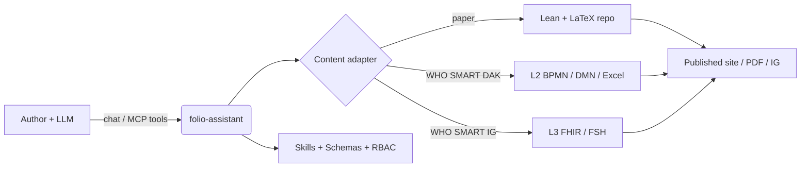
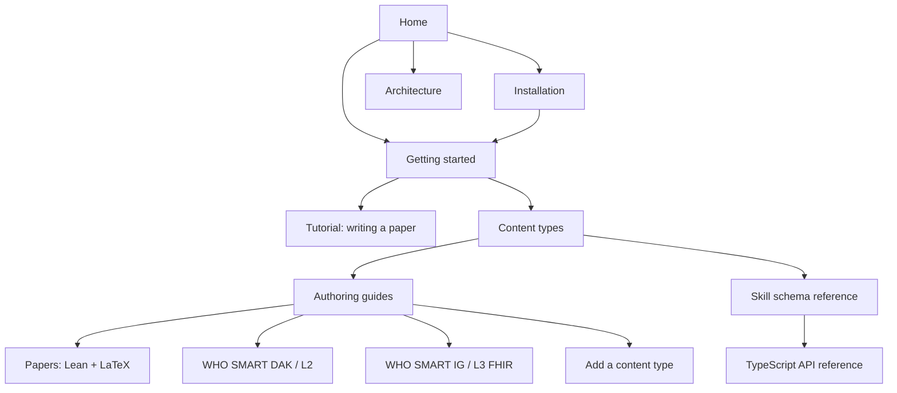

# folio-assistant
{: .fs-9 }

A content-agnostic agent skills framework for authoring rigorous content with a
large language model — scientific papers and books, WHO SMART Guidelines, and
FHIR Implementation Guides — backed by an MCP server, role-based access control,
and a typed content-object model.
{: .fs-6 .fw-300 }

[Get started](getting-started.html){: .btn .btn-primary .fs-5 .mb-4 .mb-md-0 .mr-2 }
[Install](installation.html){: .btn .fs-5 .mb-4 .mb-md-0 .mr-2 }
[View on GitHub](https://github.com/litlfred/folio-assistant){: .btn .fs-5 .mb-4 .mb-md-0 }

---

## What is folio-assistant?

**folio-assistant** is the *platform* — it does not contain content. It provides
the skills, schemas, tooling, and an MCP (Model Context Protocol) server that an
LLM-driven agent uses to plan, author, validate, review, test, and publish a
**folio** of content that lives in a separate repository.

> **Separation of concerns.** This documentation describes the *formalism of the
> framework* and *how to use folio-assistant* — deliberately kept **separate from
> any specific content**. Where content appears in these pages, it is purely
> illustrative (an *example*), never the canonical artifact.

## Supported content types

folio-assistant is **pluggable** — each content type is handled by a content
*adapter* and a matching skill *package*. The currently supported types:

| Content type | Artifacts | Skill package |
|--------------|-----------|---------------|
| **Scientific papers & books** | Lean 4 formalization + LaTeX/Markdown | [`authoring-math`](content-types.html#scientific-papers--books) |
| **WHO SMART Guidelines DAKs** | L2 artifacts — BPMN, DMN, Excel data dictionaries, personas | [`authoring-who-smart-guidelines`](content-types.html#who-smart-guidelines-daks-l2) |
| **WHO SMART Implementation Guides** | L3 FHIR resources, FSH, IG Publisher output | [`authoring-who-smart-guidelines`](content-types.html#who-smart-implementation-guides-l3) |
| **Others** | Pluggable — add a new adapter + skill package | [Adding a content type](guides/new-content-type.html) |

The cross-cutting [`content-lifecycle`](content-types.html#the-content-lifecycle)
package (plan → author → validate → review → test → publish → feedback → retire)
applies to every content type.

## Where to go next

- **[Installation](installation.html)** — prerequisites, clone, `bun install`, capability check.
- **[Getting started](getting-started.html)** — connect the MCP server to your LLM and run your first skill.
- **[Tutorial: Writing a paper with folio-assistant](guides/writing-a-paper.html)** — a full, LLM-driven walk-through with a mock chat session.
- **[Content types](content-types.html)** — the formalism of each authoring domain.
- **[Skill schema reference](reference/skills/)** — generated input/output contracts for every skill.
- **[TypeScript API reference](api/)** — the content-object model (`Block`, `Chapter`, `Paper`, builders, Zod constraints).
- **[Architecture](architecture.html)** — adapters, MCP server, RBAC, the block model.

## Documentation map

> The map nodes are clickable on the docs site.
