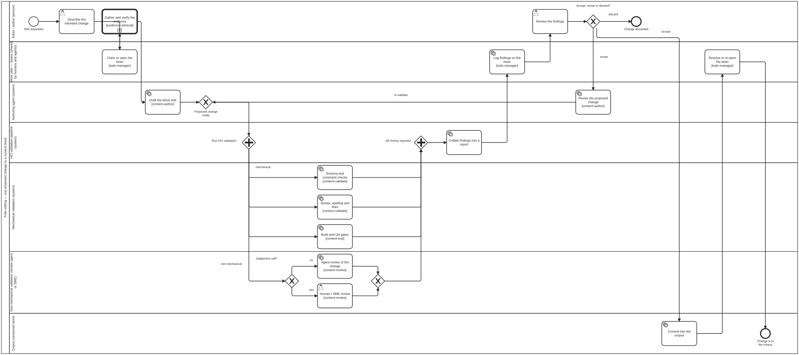
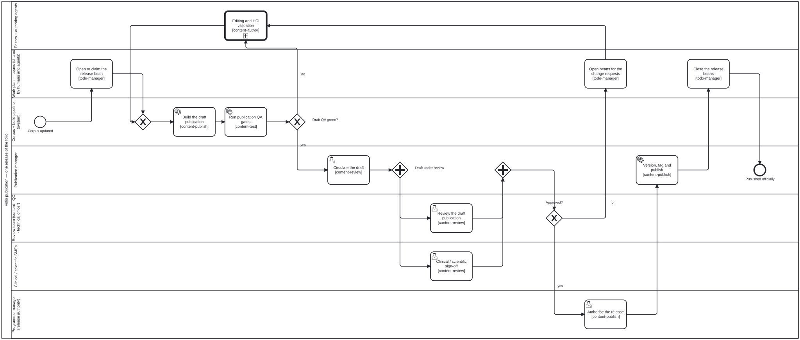
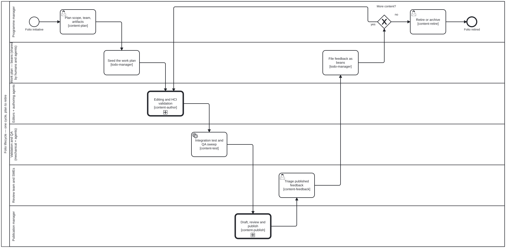

# Publication workflow
{: .no_toc }

How a change gets from *an editor had an idea* to *the folio is officially
published* — expressed as **BPMN 2.0 swimlane diagrams**, with the roles, the
validation gate, the skills, and the shared work plan all named.

1. TOC
{:toc}

---

## Every workflow in the repo

Six BPMN 2.0 files, all under
[`docs/workflows/`](https://github.com/litlfred/folio-assistant/tree/main/docs/workflows).
Each is a real BPMN 2.0 document with diagram interchange — open it in
[bpmn.io](https://demo.bpmn.io/), Camunda Modeler, or any BPMN tool. The SVGs
throughout the docs are generated from these files by `bun run render:bpmn`;
never hand-edit an SVG.

**Content-agnostic** — these three apply to every folio, and the outer ones
reference the inner ones as **call activities**, so each process is described
once and reused:

| Level | Diagram | Answers |
|-------|---------|---------|
| 1 | [Content lifecycle](#content-lifecycle-overview) — `content-lifecycle.bpmn` | One cycle of a folio, plan → retire |
| 2 | [Draft → publication](#from-corpus-to-published-folio) — `draft-to-publication.bpmn` | How the corpus becomes an officially published folio |
| 3 | [Editing & HCI validation](#editing-and-the-hci-validation-gate) — `editing-hci-validation.bpmn` | What happens to **one** proposed change to **one** content block |

**Content-type specific** — how a particular kind of folio is authored. These
sit *inside* level 3's `Draft the block edit`, and live with their guides:

| Diagram | Content type | Where it is shown |
|---------|--------------|-------------------|
| `authoring-a-paper.bpmn` | Scientific papers & books | [Writing a paper](guides/writing-a-paper.html#the-end-to-end-workflow) |
| `l2-dak-authoring.bpmn` | WHO SMART Guidelines DAK (L2) | [Authoring a WHO SMART DAK](guides/who-smart-dak.html#the-l2-artifacts) |
| `l3-fhir-pipeline.bpmn` | WHO SMART Implementation Guide (L3) | [Authoring a WHO SMART IG](guides/who-smart-ig.html#the-l3-pipeline) |

### They also run

Since bean `fq0b` these files are not only pictures. The MCP server interprets
them: `workflow_start` opens an instance for a subject, `workflow_next` reports
what is enabled *now* — with the lane that performs it and the skill that
implements it — and `workflow_complete` refuses a step the process has not
reached. `Commit into the corpus` cannot be reported done before the editor's
decision is recorded, because there is no token on it until then.

That is ordering, not enforcement: nothing yet stops an agent calling a
capability tool directly. The case for making it binding — and the argument
that the commit boundary is the right place — is in
[Proposal: workflow orchestration](proposals/workflow-orchestration.html).

### Some decisions are computed, not judged

Ten exclusive gateways sit across the six diagrams, and they are not all the
same kind of question. `Accept, revise or discard?` is the editor's call.
`Build green, no sorries?` is arithmetic over `lean_build` and `proof_status`.

A gateway carrying `<folio:decision ref="decisions/x.dmn#Decision_Id"/>` has its
outcome computed from a **DMN decision table** under
[`docs/workflows/decisions/`](https://github.com/litlfred/folio-assistant/tree/main/docs/workflows/decisions).
The agent supplies facts — `{ failCritical: 0, failMajor: 2 }` — and the table
returns the branch; `workflow_complete` refuses a hand-supplied outcome there,
and records which rule fired.

| Gateway | Table | Reads |
|---|---|---|
| `Build green, no sorries?` | `lean-build-gate.dmn` | `buildOk`, `deferredSorries` |
| `Draft QA green?` | `draft-qa-gate.dmn` | `failCritical`, `failMajor` |

`QC clean?` and `FHIR valid?` are equally mechanical and equally deserve
tables — they wait on a WHO/FHIR adapter, because a table keyed to facts no
tool emits looks authoritative and is not.

### The base processes are strict

The three content-agnostic diagrams — editing, draft-to-publication, lifecycle —
carry `<folio:policy enforcement="strict"/>`. `workflow_gate` refuses a step
they have not reached. The three per-content-type diagrams are `advisory`,
because what counts as adequate review of a Lean proof and of a FHIR profile are
different questions, and the package that knows the domain should answer them.

A content package may relax a base step by declaring it in
`skills/<package>/workflow-policy.json` **with a reason** — an unexplained
relaxation does not load, so the file is the record of what was waived and why.
Five steps refuse to be relaxed at all: `Task_ReviewFindings`,
`Gateway_EditorDecision` and `Task_Commit` (the editor seeing the findings, the
decision, the write), plus `Task_AuthorizeRelease` and `Task_PublishRelease`
(the `publish-authorized` SHALL). If those were negotiable the base would not be
strict, it would be a suggestion.

`bun run check:workflow-policy` lists the policy and validates every relaxation;
it runs in CI, so one that has stopped applying is a build failure rather than a
discovery on the day it is needed.

**The commit boundary is where this is enforced rather than merely answerable.**
`scripts/check-corpus-gate.ts`, run in the folio repo from a pre-commit hook or
CI, refuses a changed content block that no instance records the editor having
authorised. `workflow_gate` answers an agent that asks; the hook does not depend
on anyone asking.

```sh
bun run <platform>/scripts/check-corpus-gate.ts --staged --platform <platform>
bun run <platform>/scripts/check-corpus-gate.ts --staged --warn   # adopt gradually
```

### How to read them

- **A lane is a role.** Every lane maps to an actor in
  [`.claude/skills/actors/`](https://github.com/litlfred/folio-assistant/tree/main/.claude/skills/actors) —
  see [Who is who](#who-is-who).
- **`[skill-name]` under an activity** is the folio-assistant skill that
  implements it. The same reference is carried machine-readably as a
  `<folio:skill ref="…"/>` extension element on the BPMN activity.
- **The "Work plan — beans" lane** is the shared to-do store. Steps in that
  lane read and write `.beans/`, and are marked `<folio:bean store=".beans/"/>`
  in the source.
- **A thick-bordered box is a call activity** — it expands into another diagram
  on this page.

---

## Editing and the HCI validation gate

This is the diagram that matters most day to day: **one proposed change to one
content block**.

<div class="bpmn-figure">
  
</div>

[Open the BPMN source](workflows/editing-hci-validation.bpmn){: .btn .btn-outline }

### The one rule this diagram exists to state

**Nothing reaches the corpus before the editor has seen the findings.** The
authoring agent produces a *proposed* change, not a commit. That proposal fans
out through the HCI validation pipeline, the results are collated into one
report, and the editor decides — accept, revise, or discard. The `Commit into
the corpus` activity sits *after* that decision, in its own lane, and is the
only step that writes content.

### Mechanical vs non-mechanical validation

The parallel gateway splits the pipeline in two, and the split is the point:

- **Mechanical validation** — anything a machine can settle on its own, with a
  reproducible verdict: block schema and constraint rules, label prefixes,
  syntax, spelling, cross-references and citation resolution, Lean build and
  proof status, LaTeX compilation, FHIR/SUSHI validation, QA axes. No
  judgement, no negotiation; it passes or it does not.
- **Non-mechanical validation** — everything that needs judgement: is the claim
  accurate, does the prose keep the folio's voice, does the change actually say
  what the editor meant. A **review agent** handles the routine cases; anything
  turning on clinical or scientific judgement escalates to a **human reviewer or
  SME**. Both branches are the *same* stage of the pipeline — the reviewer being
  a person or an agent changes who answers, not where the answer goes.

Both branches must report before the join. A green mechanical run does not
excuse a missing review, and a clean review does not excuse a red build.

### Activities and the skills that implement them

| Activity | Lane | Skill |
|----------|------|-------|
| Describe the intended change | Editor / author | — (human) |
| Claim or open the bean | Work plan | [`todo-manager`](reference/skill-instructions/todo-manager.html) |
| Draft the block edit | Authoring agent | [`content-author`](reference/skills/content-author.html) |
| Schema and constraint checks | Mechanical validation | [`content-validate`](reference/skills/content-validate.html) |
| Syntax, spelling and links | Mechanical validation | [`content-validate`](reference/skills/content-validate.html) |
| Build and QA gates | Mechanical validation | [`content-test`](reference/skills/content-test.html) |
| Agent review of the change | Non-mechanical validation | [`content-review`](reference/skills/content-review.html) |
| Human / SME review | Non-mechanical validation | [`content-review`](reference/skills/content-review.html) |
| Collate findings into a report | HCI validation pipeline | — (pipeline) |
| Log findings on the bean | Work plan | [`todo-manager`](reference/skill-instructions/todo-manager.html) |
| Review the findings | Editor / author | — (human — this is the gate) |
| Revise the proposed change | Authoring agent | [`content-author`](reference/skills/content-author.html) |
| Commit into the corpus | Corpus | — (subject to the `commit-hygiene` requirement) |
| Resolve or re-open the bean | Work plan | [`todo-manager`](reference/skill-instructions/todo-manager.html) |

The domain-specific checks hang off `content-validate` / `content-test` by
content type:
[`lean-formalization`](reference/skills/lean-formalization.html) and
[`proof-verification`](reference/skills/proof-verification.html) for papers,
[`fhir-validation`](reference/skills/fhir-validation.html) and
[`quality-control`](reference/skills/quality-control.html) for IGs,
[`latex-authoring`](reference/skills/latex-authoring.html) for rendering.

---

## From corpus to published folio

The corpus is not the publication. A **draft** is built from it, reviewed as a
whole by the review team, and only then released.

<div class="bpmn-figure">
  
</div>

[Open the BPMN source](workflows/draft-to-publication.bpmn){: .btn .btn-outline }

Three things to note:

1. **A red draft is fixed in the editing process, not in the artifact.** The
   `no` branch off `Draft QA green?` goes back through the editing call
   activity — which means back through the HCI validation gate. Nobody patches
   a built PDF or a generated IG.
2. **Review is parallel, and both halves must land.** The review team (content
   reviewer, QC reviewer, technical officer) reviews the draft as a publication;
   the clinical or scientific SMEs sign off on the domain content. The join
   waits for both.
3. **Change requests become beans.** A `changes requested` outcome does not
   evaporate into a review thread — each request is opened as a bean, so
   whoever picks the work up next (human or agent) sees exactly what review
   asked for.

| Activity | Lane | Skill |
|----------|------|-------|
| Open or claim the release bean | Work plan | [`todo-manager`](reference/skill-instructions/todo-manager.html) |
| Build the draft publication | Corpus + build pipeline | [`content-publish`](reference/skills/content-publish.html) |
| Run publication QA gates | Corpus + build pipeline | [`content-test`](reference/skills/content-test.html) · [`quality-control`](reference/skills/quality-control.html) |
| Editing and HCI validation | Editors + authoring agents | call activity → [diagram 3](#editing-and-the-hci-validation-gate) |
| Circulate the draft | Publication manager | [`content-review`](reference/skills/content-review.html) |
| Review the draft publication | Review team | [`content-review`](reference/skills/content-review.html) |
| Clinical / scientific sign-off | SMEs | [`content-review`](reference/skills/content-review.html) |
| Open beans for the change requests | Work plan | [`todo-manager`](reference/skill-instructions/todo-manager.html) · [`content-feedback`](reference/skills/content-feedback.html) |
| Authorise the release | Programme manager | [`content-publish`](reference/skills/content-publish.html) |
| Version, tag and publish | Publication manager | [`content-publish`](reference/skills/content-publish.html) · [`ig-publication`](reference/skills/ig-publication.html) |
| Close the release beans | Work plan | [`todo-manager`](reference/skill-instructions/todo-manager.html) |

This diagram implements the `req:content-lifecycle` phase gates —
`validate-before-review`, `review-before-test`, `test-before-publish`,
`publish-authorized` — see
[`.claude/skills/requirements/content-lifecycle.json`](https://github.com/litlfred/folio-assistant/blob/main/.claude/skills/requirements/content-lifecycle.json).

---

## Content lifecycle overview

One cycle of a folio, plan to retire. Both diagrams above appear here as call
activities.

<div class="bpmn-figure">
  
</div>

[Open the BPMN source](workflows/content-lifecycle.bpmn){: .btn .btn-outline }

This is the same lifecycle as the linear
[plan → author → validate → review → test → publish → feedback → retire](content-types.html#the-content-lifecycle)
strip, with the actors and the loops made explicit. Note that
`Editing and HCI validation` runs **once per proposed change**, not once per
cycle — the linear strip flattens that.

---

## The work plan — tasks as beans

Every diagram has a **Work plan** lane, and it is not decoration. Editing work
is tracked as **beans** ([hmans/beans](https://github.com/hmans/beans)) in a
committed `.beans/` directory, which makes it the one place where a human and
an agent see the same answer to *what is done, and what is next*.

| Where in the workflow | What happens to the work plan |
|-----------------------|-------------------------------|
| Plan is agreed | The plan is seeded as beans |
| An edit starts | The bean is **claimed** (`--status in-progress`) before any drafting |
| Validation reports | Findings are appended to the bean |
| The change is committed | The bean is resolved — or left open with what is still outstanding |
| Review requests changes | Each request is opened as its own bean |
| A release ships | Shipped work is closed; what slipped stays open into the next cycle |

Why it is modelled as a lane rather than a note:

- **It is shared state, not session state.** `.beans/` is committed, so the plan
  survives a resumed session and is visible to sibling agents working other
  branches. An agent's ephemeral in-memory to-do list is not.
- **Claiming is how two workers avoid the same item.** Claim before you work,
  and never resolve someone else's bean.
- **`beans create` is not idempotent.** Check for an existing bean by exact
  title before creating one — the guard, and the incident that motivates it,
  are in
  [`todo-manager`](reference/skill-instructions/todo-manager.html).
- **Beans are not sidecars.** Machine-generated queues (QA `*.qa.json`, witness
  files, watcher queues) stay bulk JSON; they never become beans.

---

## Who is who

The roles in the lanes, and the actor definition each one maps to. Roles
**inherit** (`viewer` → `reviewer` → `author` → `admin`) and a role's
capabilities bound what the agent may do on its behalf (RBAC,
`src/core/rbac.ts`).

### People

| In the diagrams | Actor | Authority |
|-----------------|-------|-----------|
| **Editor / author** | `author` | Creates and modifies content. Decides accept / revise / discard at the HCI gate. Inherits `reviewer`. |
| **Reviewer** | `reviewer` | Views content and leaves review comments. **Cannot make direct changes.** |
| **Human / SME reviewer** (editing) | `clinical-sme` | Domain ground truth. Answers the judgement calls a review agent escalates. |
| **Review team** (draft) | `content-reviewer` | Formal approval and phase-gate sign-off — the approval authority on a draft. |
| | `qc-reviewer` | Publication-readiness QA across layers; runs the QA reports. |
| | `technical-officer` | Programme-area coordination and first-pass review. |
| **Publication manager** | `publication-manager` | Builds, versions, tags, deploys. Does not authorise the release. |
| **Programme manager** | `programme-manager` | Scope, team, timeline, governance — and **release authorisation**. |
| **Admin** | `admin` | Full administrative access: roles, settings, all content. |

Domain-authoring roles that appear inside `content-author` rather than as their
own lane: `business-analyst` (L2 DAK), `fhir-modeller` (L3 FHIR),
`terminologist` (code systems and value sets), `translator` (localisation).

### Agents and system actors

| In the diagrams | Actor | What it does — and what it cannot do |
|-----------------|-------|--------------------------------------|
| **Authoring agent** | `authoring-agent` | Drafts and revises a **proposed** change. Has `content-authoring`; **does not commit** — its output goes to the editor through the validation gate. |
| **Review agent** | `review-agent` | Non-mechanical validation: accuracy, voice, exposition. Has `review-comments` only — it reports findings, it does not approve. |
| **Mechanical validation** | `lean-mcp` | Lean 4 proof checking and diagnostics over MCP. |
| | `ig-publisher-service` | FHIR IG Publisher build and QA reporting. |

The distinction the diagrams enforce: **an agent can propose and can report, but
approval and commit are a person's.** A review agent's finding and an SME's
finding arrive at the same place in the pipeline — but neither of them decides;
the editor does, and the release is authorised by the programme manager.

For the full role list, their capabilities, and how a user is mapped to a role,
see [Skills & roles](skills.html#roles-actors).

---

## Changing these diagrams

The `.bpmn` files are the source of truth.

```sh
# 1. edit docs/workflows/<diagram>.bpmn — in a modeler, or by hand
# 2. regenerate the SVGs
bun run render:bpmn
# 3. or, in CI, just check they are not stale
bun run render:bpmn:check
```

`render:bpmn` renders each `.bpmn` with [bpmn-js](https://bpmn.io/toolkit/bpmn-js/)
in headless Chromium and writes `docs/assets/img/workflows/<diagram>.svg`. If
the sandbox ships a Chromium that does not match the pinned Playwright build,
point at it with `CHROMIUM_PATH=/path/to/chrome`.

When you add an activity, add its `<folio:skill ref="…"/>` extension (and
`<folio:bean store=".beans/"/>` if it touches the work plan) and the matching
row in the tables above — the diagram and the skill list drifting apart is the
failure this page exists to prevent.

### Which diagrams are BPMN, and which are not

Every **process** in the docs is BPMN. The diagrams that remain Mermaid are not
processes, and BPMN would be the wrong notation for them — a pool with lanes
implies actors performing activities over time, which none of these have:

| Diagram | Notation | Why |
|---------|----------|-----|
| `README.md`, [home](index.html) — "What it does" | Mermaid | Component / data-flow map of the platform, not a sequence of activities |
| [Architecture](architecture.html) — server and adapters | Mermaid | Deployment and module structure |
| [Skills & roles](skills.html) — how the five concepts compose | Mermaid | Conceptual composition, no time axis |
| [Skills & roles](skills.html) — `viewer → reviewer → author → admin` | Mermaid | An inheritance lattice, not a flow |
| [Home](index.html) — documentation map | Mermaid | Navigation graph |
| [Adding a content type](guides/new-content-type.html) — "What you provide" | Mermaid | What you hand over, not what you do |
| [Writing a paper](guides/writing-a-paper.html) — the Lean session | Mermaid `sequenceDiagram` | An interaction transcript between you, the assistant and the MCP server. BPMN's equivalent — a collaboration with message flows — would add ceremony without adding meaning |

If you add a diagram that *does* have actors, activities and a control flow,
it belongs in `docs/workflows/` as BPMN, not in a Mermaid fence.

---

## See also

- [Content types](content-types.html) — the linear lifecycle and what each type produces
- [Skills & roles](skills.html) — every skill and role, and how they compose with the LLM
- [Skill schema reference](reference/skills/) — typed input/output per skill
- [Agent onboarding](guides/agent-onboarding.html) — orientation for an agent dropped into a folio
