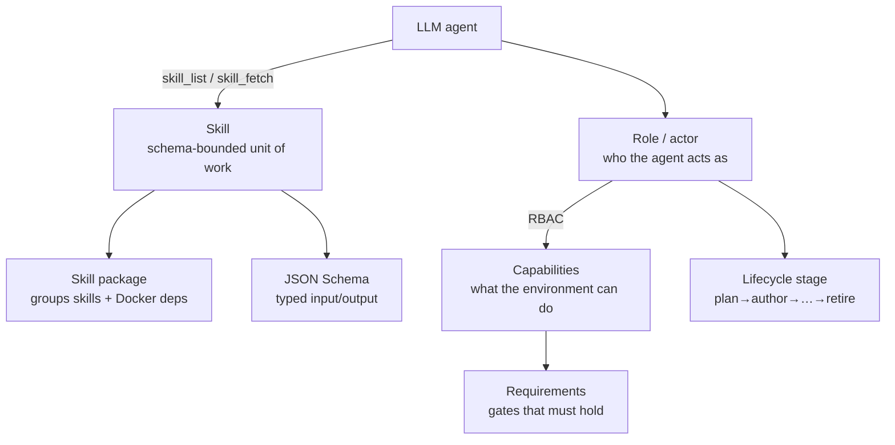
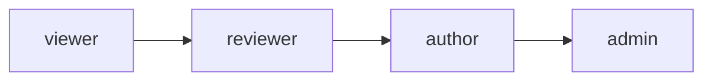

# Skills & roles
{: .no_toc }

This page is the master list of every **skill** and **role** in folio-assistant,
and explains how they fit together with the LLM. For the typed input/output
contract of each skill, see the [Skill schema reference](reference/skills/).

1. TOC
{:toc}

---

## How it works together with the LLM

folio-assistant gives an LLM agent a structured way to do real authoring work.
Five concepts compose:

1. **Skill** — a documented, schema-bounded unit of work (e.g.
   `lean-formalization`). The agent discovers skills with the `skill_list` MCP
   tool and loads a skill's instructions with `skill_fetch`. Each skill has a
   typed [input/output contract](reference/skills/).
2. **Skill package** — a group of related skills that also declares its
   Docker/runtime dependencies (`package-manifest.json`).
3. **Role (actor)** — *who* the agent is acting as. The current user maps to a
   role via `role-assignments.json`; the role's **capabilities** bound what the
   agent may do (RBAC, `src/core/rbac.ts`).
4. **Capability** — a concrete environment ability (e.g. `latex-compiler`,
   `lean-toolchain`). Skills require capabilities; `check_dependencies` probes
   them.
5. **Requirement** — a gate that must hold (e.g. `commit-hygiene`,
   `lean-verification`) before/while a stage proceeds.

The loop, in practice: the agent primes the work-plan (`work_plan_prime`),
checks it has the capabilities it needs (`check_dependencies`), lists and loads
the right skill (`skill_list` → `skill_fetch`), does the work as the user's role
(subject to RBAC), and validates/builds/publishes through the content adapter's
tools.

---

## Skills

### Where skills live (and their status)

A skill is defined across a few layers — not a single file. For any skill:

| Layer | Location | Status |
|-------|----------|--------|
| **Definition** (roles, required capabilities, requirements, routing patterns, lifecycle stages, schema ref) | `.claude/skills/local/<skill>.json` | ✅ all 18 authoring skills |
| **Typed contract** (input/output JSON Schema) | `schemas/skills/<skill>/` | ✅ all 18 — see [reference](reference/skills/) |
| **Instruction body** (prose how-to the LLM loads) | `skills/content-lifecycle/*.md`, `src/skills/*.md` | ✅ lifecycle + agent skills; ⏳ **authoring-math / authoring-who-smart-guidelines bodies are TBD** (those packages currently ship the manifest + JSON definitions) |
| **Package** (Docker/runtime deps) | `skills/<package>/package-manifest.json` | ✅ all three packages |

So *yes, the skills exist* — as structured definitions + typed schemas, with prose
bodies shipped for the lifecycle and agent skills. The `skill_fetch` MCP tool
currently serves the `src/skills/*.md` bodies; the authoring-skill prose bodies
are the next thing to fill in (the definitions and contracts they'd attach to
are already in place).

### Cross-cutting: `content-lifecycle`

The lifecycle stages that apply to **every** content type:

| Skill | Stage | Purpose |
|-------|-------|---------|
| [`content-plan`](reference/skills/content-plan.html) | plan | Scope, team, timeline, governance |
| [`content-author`](reference/skills/content-author.html) | author | Create structured artifacts |
| [`content-validate`](reference/skills/content-validate.html) | validate | Check schema + constraints |
| [`content-review`](reference/skills/content-review.html) | review | Formal review & approval |
| [`content-test`](reference/skills/content-test.html) | test | End-to-end QA / build green |
| [`content-publish`](reference/skills/content-publish.html) | publish | Render & deploy |
| [`content-feedback`](reference/skills/content-feedback.html) | feedback | Collect & triage feedback |
| `content-retire` | retire | Deprecate / archive |

### Papers & books: `authoring-math`

| Skill | Purpose |
|-------|---------|
| [`lean-formalization`](reference/skills/lean-formalization.html) | Formalize statements/proofs in Lean 4 |
| [`latex-authoring`](reference/skills/latex-authoring.html) | Author LaTeX documents |
| [`proof-verification`](reference/skills/proof-verification.html) | Verify proofs, audit `sorry`/axioms |
| `scientific-visualization` | Figures & diagrams |
| `hypothesis-generation` | Propose conjectures / directions |
| `scientific-critical-thinking` | Adversarial review of arguments |

### WHO SMART Guidelines: `authoring-who-smart-guidelines`

| Skill | Purpose |
|-------|---------|
| [`l2-dak-authoring`](reference/skills/l2-dak-authoring.html) | L2 DAK artifacts (data dictionary, etc.) |
| [`l3-fhir-authoring`](reference/skills/l3-fhir-authoring.html) | L3 FHIR resources via FSH |
| [`bpmn-authoring`](reference/skills/bpmn-authoring.html) | BPMN 2.0 business processes |
| [`dmn-authoring`](reference/skills/dmn-authoring.html) | DMN decision tables |
| [`terminology-management`](reference/skills/terminology-management.html) | Code systems / value sets |
| [`fhir-validation`](reference/skills/fhir-validation.html) | Validate against FHIR profiles |
| [`ig-publication`](reference/skills/ig-publication.html) | Build & publish the IG |
| [`quality-control`](reference/skills/quality-control.html) | QA gates |

### Agent/platform skills (`src/skills`)

Skills the LLM uses to work effectively in the repo (loaded via `skill_fetch`):

| Skill | Purpose |
|-------|---------|
| `editor` | Structured editing of content blocks |
| `readability-editing` | Prose/readability passes |
| `corpus-grep` | Search across the content corpus |
| `todo-review` | The content-review feedback workflow |
| `symbiotic-interaction` | Human↔agent collaboration patterns |
| `deployment-auth` | Deployment & auth operations |

### Local coordination skills (`.claude/skills/local`)

| Skill | Purpose |
|-------|---------|
| `prepare-merge` | Take a branch to clean/green/mergeable (see also `/watch`) |
| `bean-coordination` | Multi-agent claim/coordination discipline |
| `todo-manager` | beans-as-todos discipline |

### Platform skill bundles (`skills/folio-core`, `skills/folio-paper-adapter`)

Two larger **platform bundles** migrated from the qou content repo (see
[migration record](migrations/2026-06-29-platform-skills-migration.html) and
issue [#27](https://github.com/litlfred/folio-assistant/issues/27)). These are
content-agnostic and meant to be synced into any folio:

| Bundle | Skills | Scope |
|--------|-------:|-------|
| **`folio-core`** | 43 | Agent coordination, the watcher framework, QA / render / bibliography / glossary pipeline, docs, deployment — applies to *any* content type. |
| **`folio-paper-adapter`** | 40 | Formal-math paper-adapter (any Lean 4 + LaTeX paper): Lean workflow, proof tooling, content-object validation, LaTeX, paper structure, import, simulators. |

Irreducible QOU physics skills were skipped; QOU-specific examples in the rest
were generalized. Each bundle ships a `package-manifest.json`.

> Skill **schemas** (typed input/output for the authoring skills) are generated
> into the [Skill schema reference](reference/skills/) — never drift from what
> the framework validates.

---

## Roles (actors)

Roles answer *who the agent is acting as*. The current user is mapped to a role
by `role-assignments.json`, and the role's capabilities bound what the agent may
do (RBAC). Roles **inherit** (e.g. `author` inherits `reviewer`).

### People

| Role | What they can do |
|------|------------------|
| `viewer` | Base read-only. View content, no changes. |
| `reviewer` | View + review comments; no direct changes. |
| `author` | Create/modify content (inherits reviewer). |
| `admin` | Full administrative access — roles, settings, all content. |
| `programme-manager` | Scope, team formation, timeline, stakeholder governance. |
| `technical-officer` | Programme-area coordinator + first-pass reviewer. |
| `business-analyst` | L2 DAK author (BPMN, data dictionaries, decision logic, indicators). |
| `clinical-sme` | Clinical validator / ground-truth provider. |
| `terminologist` | Terminology governance (ICD-11, SNOMED CT, LOINC). |
| `fhir-modeller` | L3 FHIR artifacts (FSH, SUSHI, CQL, IG Publisher). |
| `content-reviewer` | Formal approval / phase-transition sign-off. |
| `qc-reviewer` | Publication-readiness QA across layers. |
| `publication-manager` | Releases, IG config, builds, versioning, publication. |
| `translator` | Localization for UN-supported languages. |

### System actors

| Actor | Provides |
|-------|----------|
| `lean-mcp` | Lean 4 proof checking & diagnostics via MCP |
| `ig-publisher-service` | FHIR IG Publisher build & QA reporting |

### Role assignment

`role-assignments.json` maps a user identity (from git config / auth) to a role
by priority. The shipped defaults:

| Pattern | Source | Role | Priority |
|---------|--------|------|----------|
| `litlfred@gmail.com` | git-config | `admin` | 100 |
| `*@who.int` | git-config | `author` | 50 |
| `*` | default | `viewer` | 0 |

---

## Capabilities & requirements

**Capabilities** are concrete environment abilities a skill may require; the
`check_dependencies` MCP tool probes them:

`bun-runtime` · `node-runtime` · `python3` · `git-push` · `docker` ·
`latex-compiler` · `lean-toolchain` · `lean-mcp` · `ig-publisher` ·
`sushi-compiler` · `java-runtime` · `jekyll` · `plantuml` · `graphviz`

**Requirements** are gates that must hold during work:

`commit-hygiene` · `lean-verification` · `fhir-validation` ·
`content-lifecycle` · `session-start`

---

## See also

- [Skill schema reference](reference/skills/) — typed input/output for each skill
- [Content types](content-types.html) — which skills each content type uses
- [Architecture](architecture.html) — RBAC, adapters, and the MCP server
- [Getting started](getting-started.html) — running your first skill
