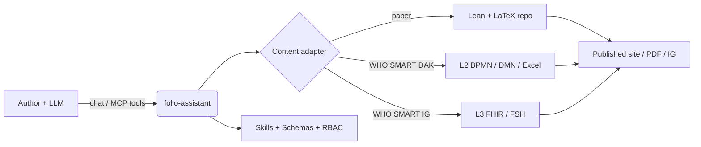
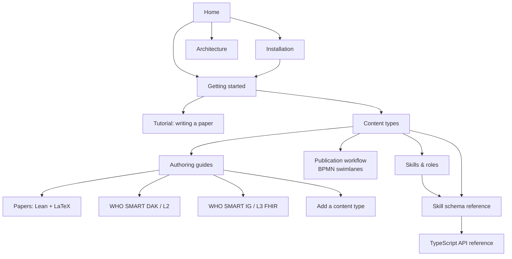

# folio-assistant
{: .fs-9 }
Un cadre de compétences d'agent indépendant du contenu pour la rédaction de contenus rigoureux avec un grand modèle de langage — articles scientifiques et livres, Lignes directrices SMART de l'OMS, et Guides d'implémentation FHIR — appuyé par un serveur MCP, un contrôle d'accès basé sur les rôles, et un modèle d'objets de contenu typé.
{: .fs-6 .fw-300 }
Démarrer{: .btn .btn-primary .fs-5 .mb-4 .mb-md-0 .mr-2 } Installer{: .btn .fs-5 .mb-4 .mb-md-0 .mr-2 } Voir sur GitHub{: .btn .fs-5 .mb-4 .mb-md-0 }
---
## Qu'est-ce que folio-assistant ?
folio-assistant est la plateforme — elle ne contient pas de contenu. Elle fournit les compétences, les schémas, les outils et un serveur MCP (Model Context Protocol) qu'un agent piloté par un LLM utilise pour planifier, rédiger, valider, réviser, tester et publier un folio de contenu qui réside dans un dépôt séparé.
> Séparation des préoccupations. Cette documentation décrit le *formalisme du
> cadre et comment utiliser folio-assistant* — délibérément maintenue **séparée de
> tout contenu spécifique**. Lorsque du contenu apparaît dans ces pages, il est purement
> illustratif (un exemple), jamais l'artefact canonique.

## Types de contenu pris en charge
folio-assistant est extensible — chaque type de contenu est géré par un adaptateur de contenu et un ensemble de compétences correspondant. Les types actuellement pris en charge :
| Type de contenu | Artefacts | Ensemble de compétences |
|--------------|-----------|---------------|
| Articles scientifiques et livres | Formalisation Lean 4 + LaTeX/Markdown | [`authoring-math`](content-types.html#scientific-papers--books) |
| Kits d'adaptation numérique (DAK) des Lignes directrices SMART de l'OMS | Artefacts L2 — BPMN, DMN, dictionnaires de données Excel, personas | [`authoring-who-smart-guidelines`](content-types.html#who-smart-guidelines-daks-l2) |
| Guides d'implémentation SMART de l'OMS | Ressources FHIR L3, FSH, sortie de l'éditeur d'IG | [`authoring-who-smart-guidelines`](content-types.html#who-smart-implementation-guides-l3) |
| Autres | Extensible — ajoutez un nouvel adaptateur + ensemble de compétences | Ajouter un type de contenu |
The cross-cutting [`content-lifecycle`](content-types.html#the-content-lifecycle)
package (plan → author → validate → review → test → publish → feedback → retire)
applies to every content type. The
[publication workflow](publication-workflow.html) models it properly — as BPMN
swimlanes, with the roles, the HCI validation gate, and the shared work plan.
## Où aller ensuite
- Installation — prérequis, clonage, vérification des capacités.
- Démarrage — connectez le serveur MCP à votre LLM et exécutez votre première compétence.
- Tutoriel : Rédiger un article avec folio-assistant — un guide complet piloté par LLM avec une session de chat simulée.
- Types de contenu — le formalisme de chaque domaine de rédaction.
- Flux de publication — diagrammes BPMN à couloirs des processus d'édition et de publication : la porte de validation IHM, qui révise quoi, et le plan de travail partagé.
- Intégration de l'agent — orientation pour un agent LLM intégré dans un folio : premiers pas, trouver les compétences, le modèle d'objets de contenu, fichiers QA.
- Compétences et rôles — chaque compétence et rôle, et comment ils fonctionnent ensemble avec le LLM.
- Référence du schéma de compétences — contrats d'entrée/sortie générés pour chaque compétence.
- Référence de l'API TypeScript — le modèle d'objets de contenu (Block, Chapter, Paper, builders, contraintes Zod).
- Architecture — adaptateurs, serveur MCP, RBAC, le modèle de blocs.
## Carte de la documentation

> Les nœuds de la carte sont cliquables sur le site de documentation.